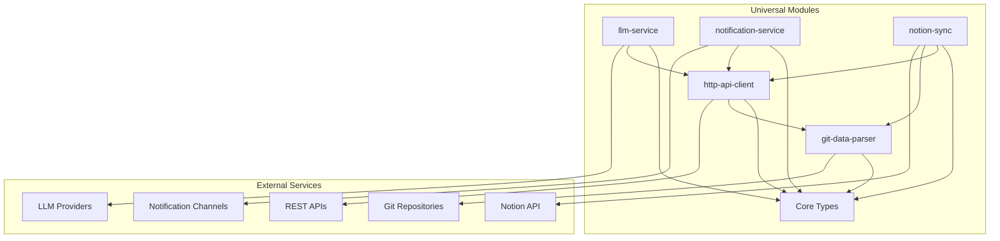
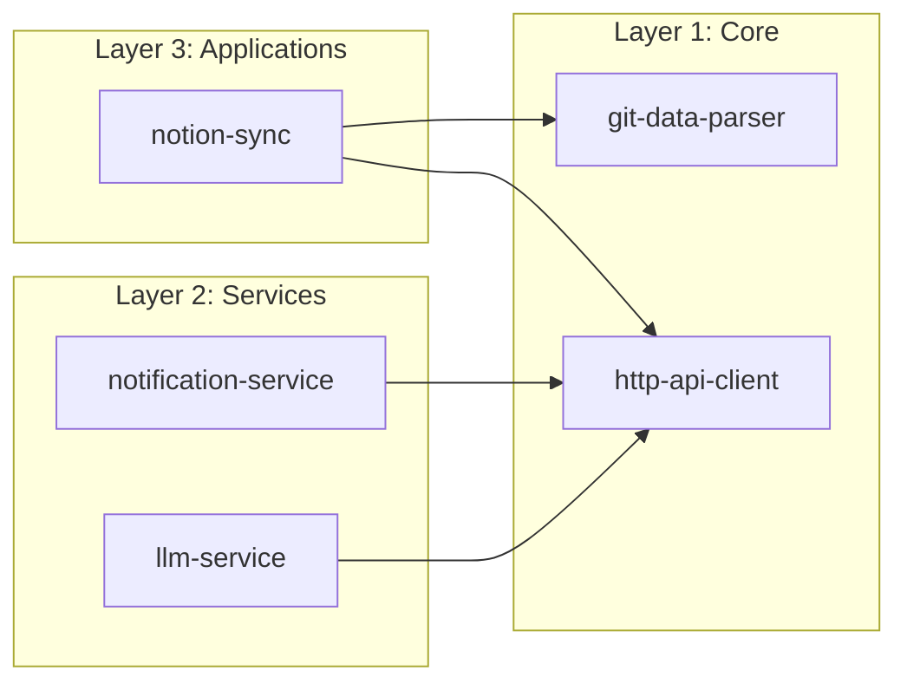

# Universal Modules

[](https://github.com/yeonjae-work/universal-modules/actions/workflows/ci-cd.yml)
[](https://codecov.io/gh/yeonjae-work/universal-modules)
[](https://universal-modules.readthedocs.io/en/latest/?badge=latest)
[](https://opensource.org/licenses/MIT)

크로스 플랫폼 개발을 위한 범용 모듈 컬렉션입니다. 각 모듈은 단일 책임 원칙을 따르며, 독립적으로 사용하거나 조합하여 사용할 수 있습니다.

## 🎯 핵심 특징

- **모듈 단위 설계**: 각 모듈은 독립적으로 개발, 테스트, 배포됩니다
- **크로스 플랫폼**: Python 3.9+ 지원으로 다양한 환경에서 동작
- **타입 안전성**: 완전한 타입 힌트와 런타임 검증 제공
- **고품질**: 95% 이상의 테스트 커버리지와 엄격한 코드 품질 기준
- **자동화**: CI/CD 파이프라인과 자동 문서 생성
- **확장성**: 마이크로서비스 아키텍처로의 전환 준비

## 📦 포함된 모듈

| 모듈 | 설명 | 버전 | PyPI |
|------|------|------|------|
| [git-data-parser](packages/git-data-parser/) | Git 데이터 파싱 및 분석 |  | [](https://pypi.org/project/universal-git-data-parser/) |
| [http-api-client](packages/http-api-client/) | 범용 HTTP API 클라이언트 |  | [](https://pypi.org/project/universal-http-api-client/) |
| [llm-service](packages/llm-service/) | LLM 통합 서비스 |  | [](https://pypi.org/project/universal-llm-service/) |
| [notification-service](packages/notification-service/) | 멀티 채널 알림 서비스 |  | [](https://pypi.org/project/universal-notification-service/) |
| [notion-sync](packages/notion-sync/) | Notion 동기화 엔진 |  | [](https://pypi.org/project/universal-notion-sync/) |

## 🚀 빠른 시작

### 전체 설치

```bash
# 모든 모듈 설치
pip install universal-modules[all]

# 개발 의존성 포함
pip install universal-modules[dev,docs]
```

### 개별 모듈 설치

```bash
# 특정 모듈만 설치
pip install universal-git-data-parser
pip install universal-http-api-client
pip install universal-llm-service
pip install universal-notification-service
pip install universal-notion-sync
```

### 기본 사용법

```python
# Git 데이터 파싱
from universal_git_data_parser import GitDataParser
parser = GitDataParser()
commits = parser.parse_commits("path/to/repo")

# HTTP API 호출
from universal_http_api_client import HTTPAPIClient, Platform
client = HTTPAPIClient(platform=Platform.GITHUB)
response = client.get("/user")

# LLM 서비스
from universal_llm_service import LLMService, LLMProvider
llm = LLMService(provider=LLMProvider.OPENAI)
result = llm.generate("Hello, world!")

# 알림 발송
from universal_notification_service import NotificationService, NotificationChannel
notifier = NotificationService()
notifier.send("메시지", channels=[NotificationChannel.SLACK])

# Notion 동기화
from universal_notion_sync import UniversalNotionSyncEngine, SyncConfiguration
config = SyncConfiguration(credentials=credentials)
engine = UniversalNotionSyncEngine(config=config)
result = engine.sync_to_target(target_id="database_id")
```

## 🛠️ 개발 환경 설정

### 요구사항

- Python 3.9 이상
- Git
- Make (선택사항, 개발 편의성을 위해)

### 설치

```bash
# 저장소 클론
git clone https://github.com/yeonjae-work/universal-modules.git
cd universal-modules

# 개발 환경 설정
make dev-setup

# 또는 수동 설치
pip install -e ".[dev,docs]"
```

### 개발 워크플로우

```bash
# 코드 포매팅
make format

# 코드 품질 검사
make quality

# 테스트 실행
make test

# 특정 모듈 테스트
make test-git-data-parser

# 문서 생성
make docs

# 빌드
make build
```

## 📊 아키텍처

### 전체 구조



### 모듈 간 의존성



## 🧪 테스트

### 테스트 실행

```bash
# 전체 테스트
make test

# 커버리지 포함
make test-coverage

# 성능 테스트
make test-performance

# 특정 모듈 테스트
make test-notion-sync
```

### 테스트 커버리지

각 모듈은 95% 이상의 테스트 커버리지를 유지합니다:

- **단위 테스트**: 개별 함수/클래스 테스트
- **통합 테스트**: 모듈 간 상호작용 테스트
- **성능 테스트**: 응답 시간 및 메모리 사용량 테스트
- **보안 테스트**: 취약점 스캔 및 보안 검사

## 📚 문서

### 기술명세서

각 모듈은 상세한 기술명세서를 제공합니다:

- [git-data-parser 기술명세서](packages/git-data-parser/docs/technical-specification.md)
- [http-api-client 기술명세서](packages/http-api-client/docs/technical-specification.md)
- [llm-service 기술명세서](packages/llm-service/docs/technical-specification.md)
- [notification-service 기술명세서](packages/notification-service/docs/technical-specification.md)
- [notion-sync 기술명세서](packages/notion-sync/docs/technical-specification.md)

### API 문서

- [온라인 문서](https://universal-modules.readthedocs.io)
- [API 참조](https://universal-modules.readthedocs.io/en/latest/api/)

## 🔧 버전 관리

### 시맨틱 버전 관리

각 모듈은 독립적인 버전을 가지며 [시맨틱 버전 관리](https://semver.org/)를 따릅니다:

```bash
# 버전 정보 확인
make version

# 버전 업데이트
make version-bump MODULE=git-data-parser TYPE=patch MESSAGE="버그 수정"
```

### 변경사항 추적

- [전체 변경사항](CHANGELOG.md)
- 모듈별 CHANGELOG.md 파일
- Git 태그를 통한 릴리스 추적

## 🚀 배포

### CI/CD 파이프라인

GitHub Actions를 통한 자동화된 CI/CD:

1. **코드 품질 검사**: Black, isort, Flake8, MyPy
2. **보안 스캔**: Bandit, Safety, pip-audit
3. **테스트**: 다중 Python 버전 테스트
4. **빌드**: 패키지 빌드 및 검증
5. **배포**: PyPI 자동 배포
6. **문서**: 자동 문서 업데이트

### 수동 배포

```bash
# 테스트 PyPI 배포
make deploy-test

# 프로덕션 배포
make deploy
```

## 🤝 기여하기

### 기여 가이드

1. **이슈 생성**: 버그 리포트 또는 기능 요청
2. **포크 및 브랜치**: 기능별 브랜치 생성
3. **개발**: 코드 작성 및 테스트
4. **품질 검사**: `make quality` 실행
5. **Pull Request**: 상세한 설명과 함께 PR 생성

### 코드 스타일

- **포매터**: Black (88자 제한)
- **Import 정렬**: isort
- **린터**: Flake8
- **타입 체커**: MyPy
- **문서**: Google 스타일 독스트링

### 커밋 메시지

```
feat(module): 새로운 기능 추가
fix(module): 버그 수정
docs(module): 문서 업데이트
test(module): 테스트 추가/수정
refactor(module): 코드 리팩토링
```

## 📈 로드맵

### 2024 Q1
- [x] 핵심 모듈 구현
- [x] CI/CD 파이프라인 구축
- [x] 기본 문서화

### 2024 Q2
- [ ] 성능 최적화
- [ ] 추가 플랫폼 지원
- [ ] 플러그인 시스템

### 2024 Q3
- [ ] 마이크로서비스 분리
- [ ] 클라우드 네이티브 지원
- [ ] 모니터링 및 로깅

## 📞 지원

### 문의 및 지원

- **이메일**: contact@codeping.ai
- **GitHub Issues**: [이슈 생성](https://github.com/yeonjae-work/universal-modules/issues)
- **Discord**: [커뮤니티 채널](https://discord.gg/universal-modules)

### 라이센스

이 프로젝트는 [MIT 라이센스](LICENSE) 하에 배포됩니다.

### 기여자

<a href="https://github.com/yeonjae-work/universal-modules/graphs/contributors">
  
</a>

---

**Universal Modules** - 모듈 단위로 설계된 범용 개발 도구 모음  
Made with ❤️ by [Universal Modules Team](https://github.com/yeonjae-work) 