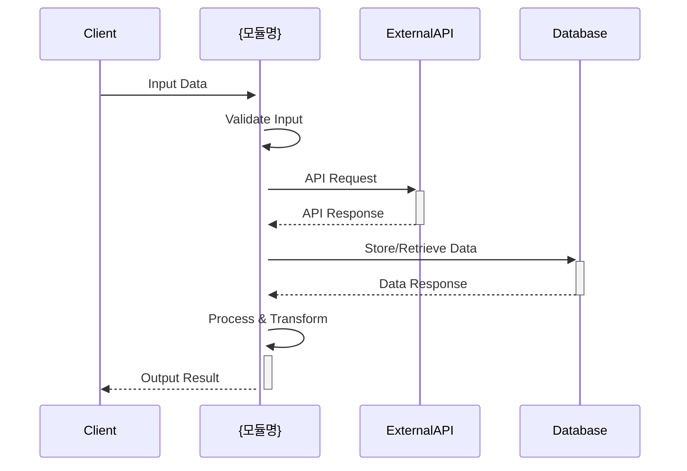
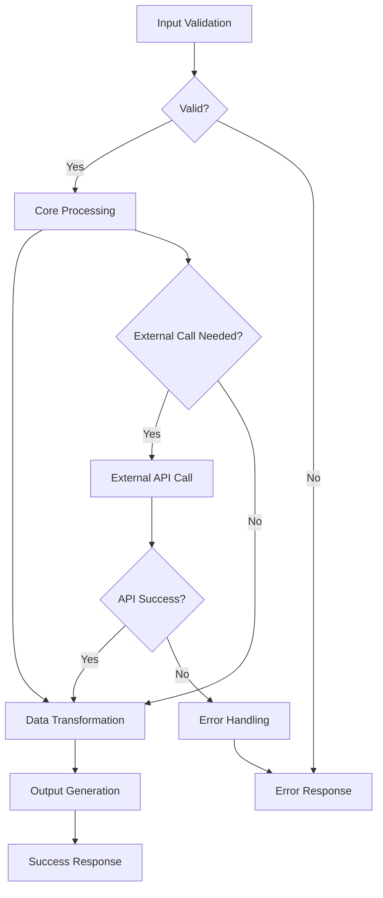

# {모듈명} 기술명세서

## 📖 모듈 개요

### 기본 정보
- **모듈명**: {모듈명}
- **버전**: {버전}
- **최종 업데이트**: {날짜}
- **담당자**: {담당자}
- **라이센스**: MIT

### 목적 및 책임
{모듈의 핵심 목적과 단일 책임 설명}

### 핵심 기능
- 기능 1: {설명}
- 기능 2: {설명}
- 기능 3: {설명}

## 🏗️ 아키텍처

### 시스템 구조
```mermaid
graph TB
    A[External Input] --> B[{모듈명}]
    B --> C[Core Service]
    B --> D[Data Models]
    B --> E[Exception Handling]
    C --> F[External Output]
```

### 컴포넌트 구조
```
{모듈명}/
├── src/
│   └── universal_{모듈명}/
│       ├── __init__.py          # 공개 API
│       ├── models.py            # 데이터 모델
│       ├── service.py           # 핵심 서비스
│       ├── exceptions.py        # 예외 정의
│       ├── utils.py            # 유틸리티
│       └── py.typed            # 타입 지원
├── tests/                      # 테스트 코드
├── docs/                       # 문서
├── pyproject.toml             # 패키지 설정
└── README.md                  # 기본 설명
```

### 의존성 다이어그램
```mermaid
graph LR
    A[{모듈명}] --> B[pydantic]
    A --> C[requests]
    A --> D[typing-extensions]
    
    subgraph "선택적 의존성"
        E[dev dependencies]
        F[platform specific]
    end
```

## 📚 사용 설명서

### 설치 방법
```bash
# 기본 설치
pip install universal-{모듈명}

# 개발 의존성 포함
pip install universal-{모듈명}[dev]

# 모든 선택적 의존성 포함
pip install universal-{모듈명}[all]
```

### 기본 사용법
```python
from universal_{모듈명} import {주요클래스}

# 기본 초기화
service = {주요클래스}()

# 주요 기능 사용
result = service.main_function(input_data)
```

### 고급 사용법
```python
# 설정 커스터마이징
config = {설정클래스}(
    option1="value1",
    option2="value2"
)

service = {주요클래스}(config=config)

# 비동기 사용 (해당하는 경우)
import asyncio

async def main():
    result = await service.async_function(data)
    return result

asyncio.run(main())
```

## 🔄 입력/출력 데이터 구조

### 입력 데이터 스키마
```python
class InputModel(BaseModel):
    """입력 데이터 모델"""
    field1: str = Field(..., description="필수 문자열 필드")
    field2: Optional[int] = Field(None, description="선택적 정수 필드")
    field3: List[str] = Field(default_factory=list, description="문자열 리스트")
    
    class Config:
        schema_extra = {
            "example": {
                "field1": "example_value",
                "field2": 123,
                "field3": ["item1", "item2"]
            }
        }
```

### 출력 데이터 스키마
```python
class OutputModel(BaseModel):
    """출력 데이터 모델"""
    success: bool = Field(..., description="처리 성공 여부")
    result: Any = Field(..., description="처리 결과")
    metadata: Dict[str, Any] = Field(default_factory=dict, description="메타데이터")
    timestamp: datetime = Field(default_factory=datetime.now, description="처리 시간")
```

### 에러 응답 스키마
```python
class ErrorResponse(BaseModel):
    """에러 응답 모델"""
    error_code: str = Field(..., description="에러 코드")
    error_message: str = Field(..., description="에러 메시지")
    details: Optional[Dict[str, Any]] = Field(None, description="상세 정보")
```

## 🌊 데이터 흐름 시각화

### 전체 데이터 흐름


### 내부 처리 흐름


## 🧪 테스트 전략

### 테스트 커버리지
- **단위 테스트**: 95% 이상
- **통합 테스트**: 주요 플로우 커버
- **성능 테스트**: 응답 시간 기준

### 테스트 실행
```bash
# 전체 테스트
pytest tests/ -v

# 커버리지 포함
pytest tests/ --cov=universal_{모듈명} --cov-report=html

# 성능 테스트
pytest tests/test_performance.py -v
```

## 🔧 설정 및 환경변수

### 환경변수
| 변수명 | 설명 | 기본값 | 필수여부 |
|--------|------|--------|----------|
| `{모듈명}_API_KEY` | API 키 | None | 선택 |
| `{모듈명}_TIMEOUT` | 타임아웃 (초) | 30 | 선택 |
| `{모듈명}_DEBUG` | 디버그 모드 | False | 선택 |

### 설정 파일 예시
```yaml
# config.yaml
{모듈명}:
  api_key: "${API_KEY}"
  timeout: 30
  retry_count: 3
  log_level: "INFO"
```

## 📈 성능 지표

### 벤치마크
- **처리 속도**: {수치} requests/second
- **메모리 사용량**: 평균 {수치} MB
- **응답 시간**: 평균 {수치} ms

### 확장성
- **동시 처리**: 최대 {수치} concurrent requests
- **데이터 크기**: 최대 {수치} MB per request

## 🚨 에러 처리

### 에러 코드 정의
| 코드 | 설명 | 해결방법 |
|------|------|----------|
| `E001` | 입력 데이터 검증 실패 | 입력 스키마 확인 |
| `E002` | 외부 API 호출 실패 | 네트워크 및 API 키 확인 |
| `E003` | 내부 처리 오류 | 로그 확인 및 재시도 |

### 로깅 전략
```python
import logging

# 로거 설정
logger = logging.getLogger('universal_{모듈명}')
logger.setLevel(logging.INFO)

# 사용 예시
logger.info("Processing started")
logger.error("Error occurred: %s", error_message)
```

## 🔗 관련 모듈 연동

### 의존 모듈
- `universal-http-api-client`: HTTP 통신
- `universal-notification-service`: 알림 발송

### 연동 예시
```python
from universal_{모듈명} import {주요클래스}
from universal_http_api_client import HTTPAPIClient

# 모듈 간 연동
api_client = HTTPAPIClient(platform=Platform.GITHUB)
service = {주요클래스}(api_client=api_client)
```

## 📝 변경 이력

### v1.0.0 (2024-01-XX)
- 초기 릴리스
- 핵심 기능 구현
- 기본 테스트 커버리지 달성

### v1.0.1 (2024-01-XX)
- 버그 수정: {구체적 내용}
- 성능 개선: {구체적 내용}
- 문서 업데이트

## 🤝 기여 가이드

### 개발 환경 설정
```bash
# 저장소 클론
git clone https://github.com/yeonjae-work/universal-modules.git

# 개발 의존성 설치
cd packages/{모듈명}
pip install -e ".[dev]"

# 테스트 실행
pytest tests/ -v
```

### 코드 스타일
- **포매터**: Black
- **린터**: Flake8
- **타입 체커**: MyPy
- **Import 정렬**: isort

### Pull Request 가이드
1. 기능 브랜치 생성
2. 테스트 코드 작성
3. 문서 업데이트
4. PR 생성 및 리뷰 요청

## 📞 지원 및 문의

### 이슈 리포팅
- **GitHub Issues**: [링크]
- **이메일**: contact@codeping.ai

### 커뮤니티
- **Discord**: [링크]
- **Slack**: [링크]

---

**문서 버전**: {문서버전}  
**마지막 업데이트**: {업데이트날짜}  
**다음 리뷰 예정**: {리뷰날짜} 