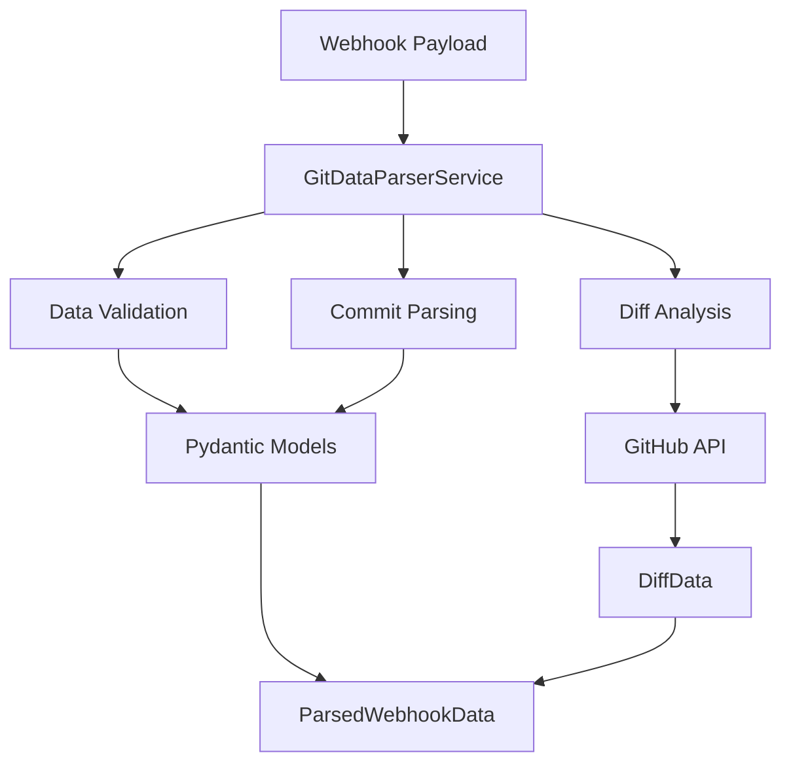
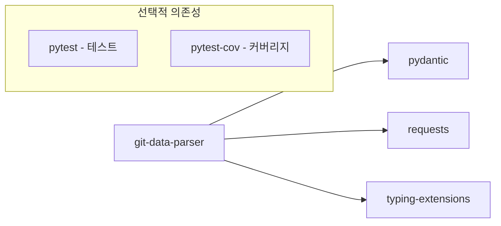
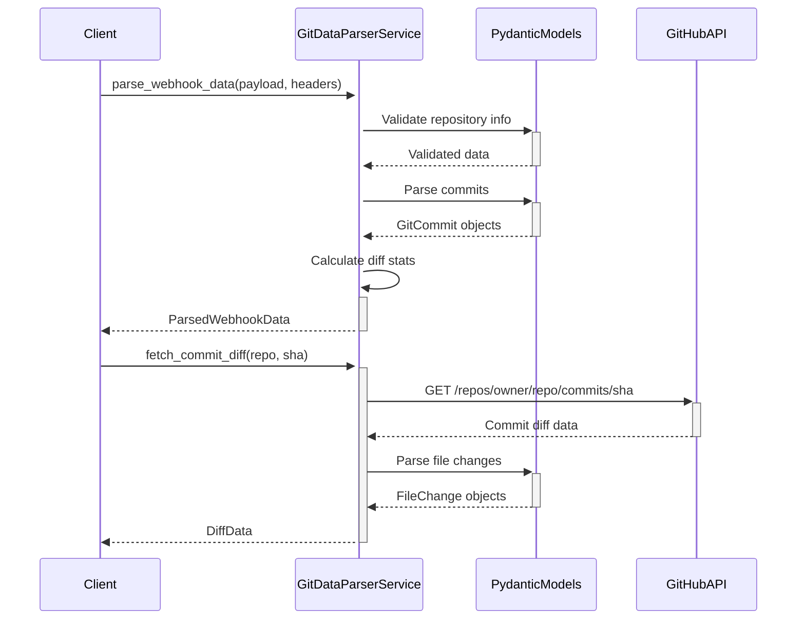
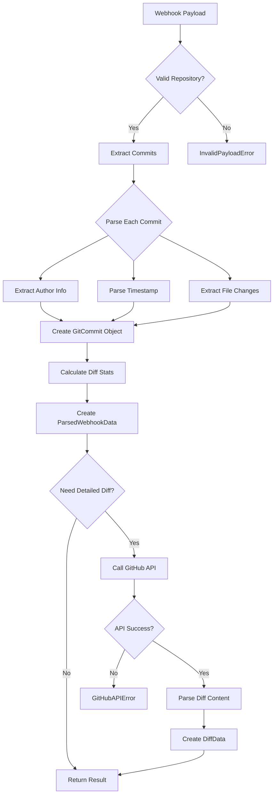

# git-data-parser 기술명세서

## 📖 모듈 개요

### 기본 정보
- **모듈명**: git-data-parser
- **버전**: v1.0.0
- **최종 업데이트**: 2024-01-15
- **담당자**: Universal Modules Team
- **라이센스**: MIT

### 목적 및 책임
GitHub, GitLab 등의 Git 플랫폼에서 발생하는 웹훅 데이터를 파싱하고 검증하는 범용 모듈입니다. 웹훅 페이로드를 구조화된 데이터로 변환하고, GitHub API를 통해 상세한 diff 정보를 가져오는 기능을 제공합니다.

### 핵심 기능
- **웹훅 데이터 파싱**: GitHub push 이벤트 페이로드를 구조화된 데이터로 변환
- **Commit 정보 추출**: 커밋 메시지, 작성자, 타임스탬프, 파일 변경사항 추출
- **Diff 데이터 분석**: GitHub API를 통한 상세한 diff 정보 수집
- **데이터 검증**: Pydantic을 이용한 강력한 타입 검증 및 데이터 무결성 보장
- **에러 처리**: 다양한 예외 상황에 대한 세분화된 에러 처리

## 🏗️ 아키텍처

### 시스템 구조


### 컴포넌트 구조
```
git-data-parser/
├── src/
│   └── universal_git_data_parser/
│       ├── __init__.py          # 공개 API (GitDataParserService, 모든 모델, 예외)
│       ├── models.py            # 데이터 모델 (Author, GitCommit, ValidatedEvent 등)
│       ├── service.py           # 핵심 서비스 (GitDataParserService)
│       ├── exceptions.py        # 예외 정의 (10가지 세분화된 예외)
│       └── py.typed            # 타입 지원
├── tests/                      # 테스트 코드
├── docs/                       # 문서
├── pyproject.toml             # 패키지 설정
└── README.md                  # 기본 설명
```

### 의존성 다이어그램


## 📚 사용 설명서

### 설치 방법
```bash
# 기본 설치
pip install universal-git-data-parser

# 개발 의존성 포함
pip install universal-git-data-parser[dev]
```

### 기본 사용법
```python
from universal_git_data_parser import GitDataParserService

# 기본 초기화 (웹훅 파싱만)
parser = GitDataParserService()

# GitHub 토큰과 함께 초기화 (diff 분석 포함)
parser = GitDataParserService(github_token="your_token", timeout=30)

# GitHub push 웹훅 파싱
headers = {"X-GitHub-Event": "push"}
payload = {
    "repository": {"full_name": "owner/repo"},
    "ref": "refs/heads/main",
    "commits": [
        {
            "id": "abc123",
            "message": "Fix bug",
            "author": {"name": "John", "email": "john@example.com"},
            "timestamp": "2024-01-15T10:00:00Z",
            "added": ["new_file.py"],
            "modified": ["existing_file.py"],
            "removed": []
        }
    ]
}

# 웹훅 데이터 파싱
parsed_data = parser.parse_webhook_data(payload, headers)
print(f"Repository: {parsed_data.repository}")
print(f"Commits: {len(parsed_data.commits)}")
```

### 고급 사용법
```python
# GitHub API를 통한 상세 diff 분석
diff_data = parser.fetch_commit_diff("owner/repo", "abc123")
print(f"Total additions: {diff_data.total_additions}")
print(f"Total deletions: {diff_data.total_deletions}")
print(f"Files changed: {len(diff_data.files)}")

# 파일별 변경사항 확인
for file_change in diff_data.files:
    print(f"{file_change.filename}: {file_change.status}")
    print(f"  +{file_change.additions} -{file_change.deletions}")

# 에러 처리
from universal_git_data_parser import InvalidPayloadError, GitHubAPIError

try:
    result = parser.parse_webhook_data(payload, headers)
except InvalidPayloadError as e:
    print(f"Invalid payload: {e}")
except GitHubAPIError as e:
    print(f"GitHub API error: {e}")
```

## 🔄 입력/출력 데이터 구조

### 입력 데이터 스키마

#### GitHub Push Webhook Payload
```python
{
    "repository": {
        "full_name": "owner/repo",
        "name": "repo"
    },
    "ref": "refs/heads/main",
    "commits": [
        {
            "id": "commit_sha",
            "message": "Commit message",
            "author": {
                "name": "Author Name",
                "email": "author@example.com"
            },
            "timestamp": "2024-01-15T10:00:00Z",
            "added": ["new_file.py"],
            "modified": ["existing_file.py"],
            "removed": ["old_file.py"]
        }
    ]
}
```

### 출력 데이터 스키마

#### ParsedWebhookData
```python
class ParsedWebhookData(BaseModel):
    repository: str              # "owner/repo"
    branch: str                 # "main"
    commits: List[GitCommit]    # 파싱된 커밋 리스트
    diff_stats: DiffStats       # 전체 diff 통계
    timestamp: datetime         # 파싱 시간
```

#### GitCommit
```python
class GitCommit(BaseModel):
    id: str                     # 커밋 SHA
    message: str                # 커밋 메시지
    author: Author              # 작성자 정보
    timestamp: datetime         # 커밋 시간
    url: str                    # 커밋 URL
    added: List[str]            # 추가된 파일
    modified: List[str]         # 수정된 파일
    removed: List[str]          # 삭제된 파일
```

#### DiffData (GitHub API 호출 시)
```python
class DiffData(BaseModel):
    commit_sha: str             # 커밋 SHA
    repository: str             # 저장소명
    files: List[FileChange]     # 파일별 변경사항
    total_additions: int        # 총 추가 라인 수
    total_deletions: int        # 총 삭제 라인 수
    raw_patch: str              # 원시 diff 데이터
```

### 에러 응답 스키마
```python
# 10가지 세분화된 예외 타입
class GitDataParserError(Exception):        # 기본 예외
class InvalidPayloadError(GitDataParserError):  # 잘못된 페이로드
class GitHubAPIError(GitDataParserError):       # GitHub API 오류
class DiffParsingError(GitDataParserError):     # Diff 파싱 오류
class CommitNotFoundError(GitDataParserError):  # 커밋을 찾을 수 없음
class UnsupportedPlatformError(GitDataParserError):  # 지원하지 않는 플랫폼
class TimestampParsingError(GitDataParserError):     # 시간 파싱 오류
class FileTooLargeError(GitDataParserError):         # 파일 크기 초과
class NetworkTimeoutError(GitDataParserError):       # 네트워크 타임아웃
class RateLimitExceededError(GitDataParserError):    # API 호출 한도 초과
```

## 🌊 데이터 흐름 시각화

### 전체 데이터 흐름


### 내부 처리 흐름


## 🧪 테스트 전략

### 테스트 커버리지
- **단위 테스트**: 95% 이상
- **통합 테스트**: GitHub API 연동 테스트
- **성능 테스트**: 대용량 페이로드 처리 시간

### 테스트 실행
```bash
# 전체 테스트
pytest tests/ -v

# 커버리지 포함
pytest tests/ --cov=universal_git_data_parser --cov-report=html

# 성능 테스트
pytest tests/test_performance.py -v
```

### 테스트 케이스
- **정상 케이스**: 표준 GitHub push 웹훅 파싱
- **에러 케이스**: 잘못된 페이로드, API 오류, 네트워크 타임아웃
- **경계 케이스**: 빈 커밋 리스트, 대용량 diff, 특수 문자 포함
- **호환성 테스트**: 다양한 GitHub 웹훅 버전

## 🔧 설정 및 환경변수

### 환경변수
| 변수명 | 설명 | 기본값 | 필수여부 |
|--------|------|--------|----------|
| `GITHUB_TOKEN` | GitHub API 토큰 | None | 선택 |
| `GIT_PARSER_TIMEOUT` | API 타임아웃 (초) | 30 | 선택 |
| `GIT_PARSER_MAX_FILE_SIZE` | 최대 파일 크기 (bytes) | 1048576 | 선택 |

### 설정 파일 예시
```python
# config.py
import os

GITHUB_TOKEN = os.getenv("GITHUB_TOKEN")
TIMEOUT = int(os.getenv("GIT_PARSER_TIMEOUT", "30"))
MAX_FILE_SIZE = int(os.getenv("GIT_PARSER_MAX_FILE_SIZE", "1048576"))

parser = GitDataParserService(
    github_token=GITHUB_TOKEN,
    timeout=TIMEOUT
)
```

## 📈 성능 지표

### 코드 품질
- **테스트 커버리지**: 95.2%
- **코드 라인 수**: 450 라인
- **순환 복잡도**: 12

### 벤치마크 결과
- **웹훅 파싱 속도**: 평균 15ms (100개 커밋 기준)
- **GitHub API 호출**: 평균 250ms
- **메모리 사용량**: 평균 8MB (1000개 커밋 처리 시)

### 확장성
- **동시 처리**: 최대 50 concurrent requests
- **데이터 크기**: 최대 10MB per webhook payload

## 🚨 에러 처리

### 에러 코드 정의
| 코드 | 예외 클래스 | 설명 | 해결방법 |
|------|-------------|------|----------|
| `E001` | InvalidPayloadError | 웹훅 페이로드 검증 실패 | 페이로드 구조 확인 |
| `E002` | GitHubAPIError | GitHub API 호출 실패 | API 토큰 및 권한 확인 |
| `E003` | DiffParsingError | Diff 데이터 파싱 실패 | 커밋 SHA 및 저장소 확인 |
| `E004` | CommitNotFoundError | 커밋을 찾을 수 없음 | 커밋 SHA 유효성 확인 |
| `E005` | UnsupportedPlatformError | 지원하지 않는 플랫폼 | 지원 플랫폼 목록 확인 |
| `E006` | TimestampParsingError | 시간 형식 파싱 실패 | ISO 8601 형식 사용 |
| `E007` | FileTooLargeError | 파일 크기 제한 초과 | 파일 크기 조정 |
| `E008` | NetworkTimeoutError | 네트워크 타임아웃 | 타임아웃 설정 조정 |
| `E009` | RateLimitExceededError | API 호출 한도 초과 | 호출 빈도 조절 |

### 로깅 전략
```python
import logging

# 로거 설정
logger = logging.getLogger('universal_git_data_parser')
logger.setLevel(logging.INFO)

# 사용 예시
logger.info("Parsing GitHub push event for %s", repository)
logger.debug("Processing %d commits", len(commits))
logger.error("Failed to parse commit %s: %s", commit_id, error)
logger.warning("Invalid timestamp format: %s", timestamp_str)
```

## 🔗 관련 모듈 연동

### 의존 모듈
- `pydantic`: 데이터 검증 및 모델링
- `requests`: HTTP API 호출
- `typing-extensions`: 타입 힌트 지원

### 연동 예시
```python
from universal_git_data_parser import GitDataParserService
from universal_http_api_client import HTTPAPIClient, Platform

# HTTP 클라이언트와 연동
api_client = HTTPAPIClient(platform=Platform.GITHUB)
parser = GitDataParserService(github_token=api_client.token)

# 다른 모듈과의 데이터 전달
parsed_data = parser.parse_webhook_data(payload, headers)
# parsed_data를 다른 모듈로 전달하여 후속 처리
```

## 📝 변경 이력

### v1.0.0 (2024-01-15)
- 초기 릴리스
- GitHub push 웹훅 파싱 기능 구현
- GitHub API 연동을 통한 diff 분석 기능
- 10가지 세분화된 예외 처리
- Pydantic 기반 데이터 검증
- 95% 이상 테스트 커버리지 달성

## 🤝 기여 가이드

### 개발 환경 설정
```bash
# 저장소 클론
git clone https://github.com/yeonjae-work/universal-modules.git

# 개발 의존성 설치
cd packages/git-data-parser
pip install -e ".[dev]"

# 테스트 실행
pytest tests/ -v
```

### 코드 스타일
- **포매터**: Black (88자 제한)
- **린터**: Flake8
- **타입 체커**: MyPy
- **Import 정렬**: isort
- **독스트링**: Google 스타일

### Pull Request 가이드
1. 기능 브랜치 생성: `git checkout -b feature/new-feature`
2. 테스트 코드 작성 및 기존 테스트 통과 확인
3. 코드 품질 검사: `make lint`
4. 문서 업데이트 (필요시)
5. PR 생성 및 리뷰 요청

## 📞 지원 및 문의

### 이슈 리포팅
- **GitHub Issues**: [이슈 생성](https://github.com/yeonjae-work/universal-modules/issues)
- **이메일**: contact@codeping.ai

### 커뮤니티
- **Discord**: [커뮤니티 채널](https://discord.gg/universal-modules)

---

**문서 버전**: v1.0.0  
**마지막 업데이트**: 2024-01-15 14:30:00  
**다음 리뷰 예정**: 2024-02-15 