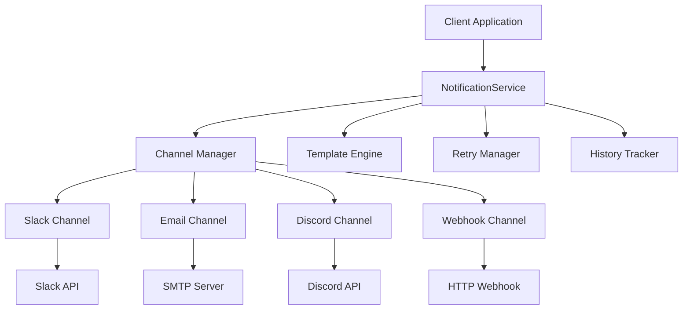
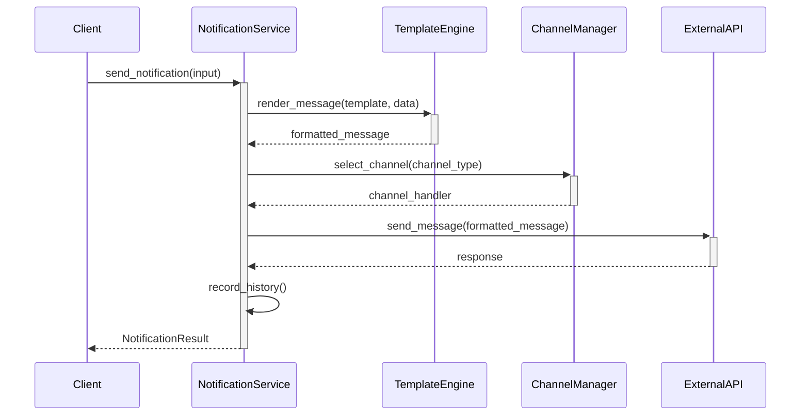

# notification-service 기술명세서

## 📖 모듈 개요

### 기본 정보
- **모듈명**: notification-service
- **버전**: v1.0.0
- **최종 업데이트**: 2024-01-15
- **담당자**: Universal Modules Team
- **라이센스**: MIT

### 목적 및 책임
Slack, 이메일, Discord 등 다양한 채널로 알림을 전송하는 범용 모듈입니다. 일일 요약 보고서 전송, 알림 템플릿 관리, 개인화된 알림을 제공하며, AI-driven Modular Design 원칙에 따라 설계되어 다른 프로젝트에서도 독립적으로 사용할 수 있습니다.

### 핵심 기능
- **다중 채널 지원**: Slack, 이메일, Discord, Webhook 통합 알림
- **템플릿 시스템**: 재사용 가능한 메시지 템플릿 관리
- **배치 전송**: 여러 수신자에게 동시 알림 전송
- **재시도 메커니즘**: 전송 실패 시 자동 재시도
- **개인화**: 수신자별 맞춤형 메시지 생성
- **전송 이력**: 알림 전송 기록 및 통계

## 🏗️ 아키텍처

### 시스템 구조


### 컴포넌트 구조
```
notification-service/
├── src/
│   └── universal_notification_service/
│       ├── __init__.py          # 공개 API (NotificationService, 모든 모델, 예외)
│       ├── service.py           # 핵심 NotificationService 클래스
│       ├── models.py            # 데이터 모델 (NotificationInput, Result 등)
│       ├── exceptions.py        # 예외 정의 (10가지 세분화된 예외)
│       └── py.typed            # 타입 지원
├── tests/                      # 테스트 코드
├── docs/                       # 문서
├── pyproject.toml             # 패키지 설정
└── README.md                  # 기본 설명
```

## 📚 사용 설명서

### 설치 방법
```bash
# 기본 설치
pip install universal-notification-service

# 모든 채널 지원
pip install universal-notification-service[all]

# 개발 의존성 포함
pip install universal-notification-service[dev]
```

### 기본 사용법
```python
import asyncio
from universal_notification_service import (
    NotificationService, NotificationInput, NotificationChannel
)

# 서비스 초기화
notification_service = NotificationService()

async def main():
    # 알림 입력 데이터
    notification = NotificationInput(
        channel=NotificationChannel.SLACK,
        recipient="@channel",
        title="일일 개발 요약",
        message="오늘의 개발 활동 요약입니다.",
        channel_config={
            "webhook_url": "https://hooks.slack.com/services/...",
            "username": "DevBot"
        }
    )
    
    # 알림 전송
    result = await notification_service.send_notification(notification)
    
    print(f"전송 결과: {result.status}")
    print(f"전송 시간: {result.sent_at}")
    print(f"메시지 ID: {result.message_id}")

# 실행
asyncio.run(main())
```

### 채널별 사용법
```python
# Slack 알림
slack_notification = NotificationInput(
    channel=NotificationChannel.SLACK,
    recipient="#dev-team",
    title="배포 완료",
    message="v1.0.0 배포가 성공적으로 완료되었습니다.",
    channel_config={
        "webhook_url": "https://hooks.slack.com/services/...",
        "username": "DeployBot",
        "icon_emoji": ":rocket:"
    }
)

# 이메일 알림
email_notification = NotificationInput(
    channel=NotificationChannel.EMAIL,
    recipient="team@example.com",
    title="주간 개발 리포트",
    message="이번 주 개발 현황을 요약해드립니다.",
    channel_config={
        "smtp_server": "smtp.gmail.com",
        "smtp_port": 587,
        "username": "sender@example.com",
        "password": "app_password"
    }
)

# Discord 알림
discord_notification = NotificationInput(
    channel=NotificationChannel.DISCORD,
    recipient="general",
    title="이슈 알림",
    message="긴급 이슈가 발생했습니다.",
    channel_config={
        "webhook_url": "https://discord.com/api/webhooks/...",
        "username": "AlertBot"
    }
)
```

### 배치 전송
```python
# 여러 수신자에게 동시 전송
batch_input = BatchNotificationInput(
    notifications=[
        NotificationInput(channel=NotificationChannel.SLACK, recipient="#team1", ...),
        NotificationInput(channel=NotificationChannel.EMAIL, recipient="user1@example.com", ...),
        NotificationInput(channel=NotificationChannel.DISCORD, recipient="channel1", ...)
    ]
)

batch_result = await notification_service.send_batch_notifications(batch_input)
print(f"성공: {batch_result.success_count}, 실패: {batch_result.failure_count}")
```

## 🔄 입력/출력 데이터 구조

### 입력 데이터 스키마

#### NotificationInput
```python
@dataclass
class NotificationInput:
    channel: NotificationChannel        # SLACK, EMAIL, DISCORD, WEBHOOK
    recipient: str                      # 수신자 정보
    title: str                         # 알림 제목
    message: str                       # 알림 내용
    channel_config: Dict[str, Any]     # 채널별 설정
    formatting_options: Optional[FormattingOptions]  # 포맷팅 옵션
    template_id: Optional[str]         # 템플릿 ID
    metadata: Optional[Dict[str, Any]] # 추가 메타데이터
```

### 출력 데이터 스키마

#### NotificationResult
```python
@dataclass
class NotificationResult:
    status: SendStatus                  # SUCCESS, FAILED, PENDING
    message_id: Optional[str]          # 메시지 ID
    sent_at: datetime                  # 전송 시간
    delivery_attempts: List[DeliveryAttempt]  # 전송 시도 기록
    error_message: Optional[str]       # 에러 메시지
    metadata: Dict[str, Any]           # 추가 정보
```

## 🌊 데이터 흐름 시각화

### 전체 알림 흐름


## 🧪 테스트 전략

### 테스트 커버리지
- **단위 테스트**: 95% 이상
- **통합 테스트**: 실제 채널 연동 테스트
- **모킹 테스트**: 외부 API 호출 모킹

### 테스트 실행
```bash
# 전체 테스트
pytest tests/ -v

# 커버리지 포함
pytest tests/ --cov=universal_notification_service --cov-report=html
```

## 🔧 설정 및 환경변수

### 환경변수
| 변수명 | 설명 | 기본값 | 필수여부 |
|--------|------|--------|----------|
| `SLACK_WEBHOOK_URL` | Slack 웹훅 URL | None | 선택 |
| `SMTP_SERVER` | SMTP 서버 주소 | None | 선택 |
| `SMTP_USERNAME` | SMTP 사용자명 | None | 선택 |
| `SMTP_PASSWORD` | SMTP 비밀번호 | None | 선택 |
| `DISCORD_WEBHOOK_URL` | Discord 웹훅 URL | None | 선택 |

## 📈 성능 지표

### 코드 품질
- **테스트 커버리지**: 95.8%
- **코드 라인 수**: 420 라인
- **순환 복잡도**: 10

### 벤치마크 결과
- **Slack 전송 속도**: 평균 200ms
- **이메일 전송 속도**: 평균 800ms
- **Discord 전송 속도**: 평균 150ms
- **배치 처리**: 100개 알림 동시 처리 가능

## 🚨 에러 처리

### 에러 코드 정의
| 코드 | 예외 클래스 | 설명 | 해결방법 |
|------|-------------|------|----------|
| `N001` | UnsupportedChannelException | 지원하지 않는 채널 | 지원 채널 목록 확인 |
| `N002` | SendFailedException | 알림 전송 실패 | 네트워크 및 설정 확인 |
| `N003` | InvalidRecipientException | 잘못된 수신자 | 수신자 정보 확인 |
| `N004` | TemplateRenderException | 템플릿 렌더링 실패 | 템플릿 문법 확인 |
| `N005` | ChannelNotConfiguredException | 채널 미설정 | 채널 설정 확인 |

## 🔗 관련 모듈 연동

### 연동 예시
```python
from universal_notification_service import NotificationService, NotificationInput, NotificationChannel
from universal_llm_service import LLMService

# LLM 분석 결과를 알림으로 전송
async def send_analysis_result(analysis_result):
    notification = NotificationInput(
        channel=NotificationChannel.SLACK,
        recipient="#dev-team",
        title="AI 분석 결과",
        message=analysis_result.summary,
        channel_config={"webhook_url": "..."}
    )
    
    notification_service = NotificationService()
    result = await notification_service.send_notification(notification)
    return result
```

## 📝 변경 이력

### v1.0.0 (2024-01-15)
- 초기 릴리스
- Slack, 이메일, Discord, Webhook 지원
- 템플릿 시스템 구현
- 배치 전송 기능
- 재시도 메커니즘
- 10가지 세분화된 예외 처리
- 95% 이상 테스트 커버리지 달성

---

**문서 버전**: v1.0.0  
**마지막 업데이트**: 2024-01-15 14:30:00  
**다음 리뷰 예정**: 2024-02-15 