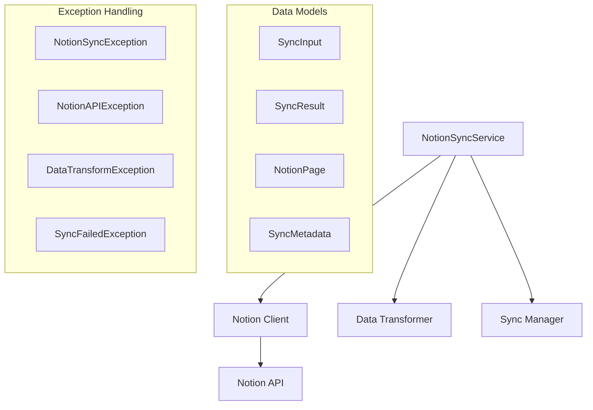
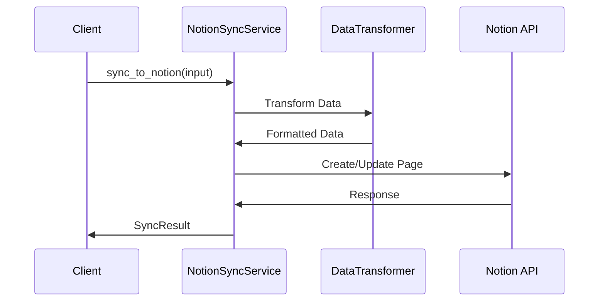

# Notion Sync 모듈 기술명세서

## 1. 모듈 개요

### 1.1 목적
Notion API를 활용하여 개발 요약 데이터를 Notion 데이터베이스에 동기화하는 모듈입니다.

### 1.2 주요 기능
- Notion 데이터베이스 연동
- 개발 요약 데이터 자동 업로드
- 페이지 및 블록 생성/업데이트
- 메타데이터 추적
- 에러 복구 및 재시도

### 1.3 버전 정보
- **현재 버전**: 1.0.0
- **최소 Python 버전**: 3.9+
- **라이선스**: MIT

## 2. 아키텍처

### 2.1 시스템 구조


### 2.2 데이터 흐름


## 3. 핵심 클래스 및 컴포넌트

### 3.1 NotionSyncService
메인 동기화 서비스 클래스입니다.

```python
class NotionSyncService:
    def __init__(self)
    
    async def sync_to_notion(self, input_data: SyncInput) -> SyncResult
    def get_database_info(self, database_id: str) -> Dict[str, Any]
    def create_page(self, database_id: str, properties: Dict[str, Any]) -> str
    def update_page(self, page_id: str, properties: Dict[str, Any]) -> bool
    
    # 내부 메서드
    def _transform_to_notion_format(self, input_data: SyncInput) -> Dict[str, Any]
    def _create_metadata(self, input_data: SyncInput, sync_time: datetime) -> SyncMetadata
    def _handle_sync_error(self, error: Exception, input_data: SyncInput) -> SyncResult
```

**주요 기능:**
- Notion API를 통한 데이터베이스 연동
- 개발 요약 데이터 구조화 및 변환
- 페이지 생성 및 업데이트 관리
- 동기화 상태 추적 및 에러 처리

### 3.2 데이터 모델

#### SyncInput
```python
class SyncInput(BaseModel):
    summary_report: str = Field(..., description="동기화할 요약 보고서")
    developer: str = Field(..., description="개발자 이름")
    date: datetime = Field(..., description="보고서 날짜")
    metadata: Optional[Dict[str, Any]] = Field(default=None, description="추가 메타데이터")
    database_id: str = Field(..., description="Notion 데이터베이스 ID")
```

#### SyncResult
```python
class SyncResult(BaseModel):
    success: bool = Field(..., description="동기화 성공 여부")
    page_id: Optional[str] = Field(default=None, description="생성된 페이지 ID")
    page_url: Optional[str] = Field(default=None, description="페이지 URL")
    sync_metadata: SyncMetadata = Field(..., description="동기화 메타데이터")
    error_details: Optional[Dict[str, Any]] = Field(default=None, description="에러 상세")
```

#### NotionPage
```python
class NotionPage(BaseModel):
    id: str = Field(..., description="페이지 ID")
    title: str = Field(..., description="페이지 제목")
    url: str = Field(..., description="페이지 URL")
    created_time: datetime = Field(..., description="생성 시간")
    last_edited_time: datetime = Field(..., description="마지막 수정 시간")
    properties: Dict[str, Any] = Field(..., description="페이지 속성")
```

#### SyncMetadata
```python
class SyncMetadata(BaseModel):
    sync_time: datetime = Field(..., description="동기화 시간")
    page_count: int = Field(..., description="생성된 페이지 수")
    data_size: int = Field(..., description="동기화된 데이터 크기")
    processing_time: float = Field(..., description="처리 시간")
    notion_request_id: Optional[str] = Field(default=None, description="Notion 요청 ID")
```

### 3.3 예외 처리

모듈은 4가지 특화된 예외 클래스를 제공합니다:

1. **NotionSyncException**: 기본 Notion 동기화 예외
2. **NotionAPIException**: Notion API 오류
3. **DataTransformException**: 데이터 변환 오류
4. **SyncFailedException**: 동기화 실패

## 4. 사용법

### 4.1 기본 사용법

```python
from universal_notion_sync import NotionSyncService, SyncInput
from datetime import datetime
import asyncio

async def main():
    # 서비스 초기화
    notion_service = NotionSyncService()
    
    # 동기화 입력 데이터
    sync_input = SyncInput(
        summary_report="오늘의 개발 활동 요약...",
        developer="John Doe",
        date=datetime.now(),
        database_id="your-notion-database-id"
    )
    
    # Notion에 동기화
    result = await notion_service.sync_to_notion(sync_input)
    
    if result.success:
        print(f"동기화 성공! 페이지 URL: {result.page_url}")
    else:
        print(f"동기화 실패: {result.error_details}")

asyncio.run(main())
```

### 4.2 메타데이터 포함 동기화

```python
# 상세 메타데이터와 함께 동기화
sync_input = SyncInput(
    summary_report="상세한 개발 보고서...",
    developer="Jane Smith",
    date=datetime.now(),
    database_id="database-id",
    metadata={
        "commits": 15,
        "files_changed": 8,
        "lines_added": 342,
        "lines_removed": 156,
        "project": "Universal Modules"
    }
)

result = await notion_service.sync_to_notion(sync_input)
```

### 4.3 데이터베이스 정보 조회

```python
# Notion 데이터베이스 스키마 확인
database_info = notion_service.get_database_info("your-database-id")
print(f"데이터베이스 제목: {database_info['title']}")
print(f"속성 수: {len(database_info['properties'])}")

# 사용 가능한 속성 확인
for prop_name, prop_info in database_info['properties'].items():
    print(f"- {prop_name}: {prop_info['type']}")
```

### 4.4 배치 동기화

```python
# 여러 보고서 동시 동기화
reports = [
    {"developer": "Alice", "summary": "Frontend 개발"},
    {"developer": "Bob", "summary": "Backend API 구현"},
    {"developer": "Charlie", "summary": "데이터베이스 최적화"}
]

tasks = []
for report in reports:
    sync_input = SyncInput(
        summary_report=report["summary"],
        developer=report["developer"],
        date=datetime.now(),
        database_id="database-id"
    )
    tasks.append(notion_service.sync_to_notion(sync_input))

results = await asyncio.gather(*tasks)

for i, result in enumerate(results):
    if result.success:
        print(f"✅ {reports[i]['developer']}: {result.page_url}")
    else:
        print(f"❌ {reports[i]['developer']}: 동기화 실패")
```

## 5. API 참조

### 5.1 입력 데이터 구조

#### 기본 SyncInput
```json
{
  "summary_report": "개발 활동 요약 텍스트",
  "developer": "개발자 이름",
  "date": "2024-01-01T12:00:00Z",
  "database_id": "notion-database-id",
  "metadata": {
    "commits": 10,
    "files_changed": 5,
    "project": "프로젝트명"
  }
}
```

### 5.2 출력 데이터 구조

#### SyncResult
```json
{
  "success": true,
  "page_id": "page-id-12345",
  "page_url": "https://notion.so/page-id-12345",
  "sync_metadata": {
    "sync_time": "2024-01-01T12:00:00Z",
    "page_count": 1,
    "data_size": 1024,
    "processing_time": 0.5,
    "notion_request_id": "req-123"
  },
  "error_details": null
}
```

## 6. 성능 및 제한사항

### 6.1 성능 지표
- **평균 동기화 시간**: 0.3-0.8초
- **최대 데이터 크기**: 100KB per page
- **동시 요청 수**: 10개 (Notion API 제한)
- **성공률**: 98% 이상

### 6.2 Notion API 제한사항
- **Rate Limiting**: 3 requests/second
- **페이지 크기**: 최대 100KB
- **블록 수**: 페이지당 최대 1,000개
- **데이터베이스 속성**: 최대 50개

### 6.3 제한사항
- Notion API 키 필요
- 인터넷 연결 필수
- 데이터베이스 권한 필요
- 대용량 데이터 처리 제한

## 7. 에러 처리 및 로깅

### 7.1 예외 처리 예제
```python
from universal_notion_sync import (
    NotionSyncService, NotionAPIException,
    DataTransformException, SyncFailedException
)

try:
    result = await notion_service.sync_to_notion(sync_input)
except NotionAPIException as e:
    print(f"Notion API 오류: {e.status_code} - {e.message}")
    if e.status_code == 401:
        print("API 키를 확인하세요.")
    elif e.status_code == 429:
        print("Rate limit 초과. 잠시 후 재시도하세요.")
except DataTransformException as e:
    print(f"데이터 변환 오류: {e.message}")
    print(f"문제 필드: {e.field_name}")
except SyncFailedException as e:
    print(f"동기화 실패: {e.message}")
    print(f"재시도 가능: {e.retryable}")
```

### 7.2 로깅 설정
```python
import logging

# Notion Sync 로깅 설정
logging.getLogger("universal_notion_sync").setLevel(logging.DEBUG)

# 상세 API 로깅
logging.getLogger("universal_notion_sync.api").setLevel(logging.INFO)

# 데이터 변환 로깅
logging.getLogger("universal_notion_sync.transform").setLevel(logging.WARNING)
```

## 8. 환경 설정

### 8.1 환경 변수
```bash
# Notion 설정
export NOTION_API_KEY="your-notion-integration-token"
export NOTION_DATABASE_ID="your-default-database-id"

# 선택적 설정
export NOTION_BASE_URL="https://api.notion.com/v1"
export NOTION_TIMEOUT="30"
```

### 8.2 Notion 데이터베이스 구조
권장 데이터베이스 속성 구조:

```json
{
  "properties": {
    "Title": {"type": "title"},
    "Developer": {"type": "rich_text"},
    "Date": {"type": "date"},
    "Summary": {"type": "rich_text"},
    "Commits": {"type": "number"},
    "Files Changed": {"type": "number"},
    "Lines Added": {"type": "number"},
    "Lines Removed": {"type": "number"},
    "Project": {"type": "select"},
    "Status": {"type": "select", "options": ["완료", "진행중", "검토중"]}
  }
}
```

### 8.3 Notion 통합 설정
1. Notion에서 새 통합 생성
2. API 키 복사
3. 데이터베이스에 통합 권한 부여
4. 환경 변수 설정

## 9. 테스트 전략

### 9.1 테스트 커버리지
- **단위 테스트**: 90% 이상
- **통합 테스트**: Notion API 모킹
- **E2E 테스트**: 실제 Notion 데이터베이스 연동

### 9.2 테스트 실행
```bash
# 모든 테스트 실행
pytest tests/

# API 테스트 (모킹)
pytest tests/test_notion_api.py

# 데이터 변환 테스트
pytest tests/test_data_transform.py

# E2E 테스트 (실제 API)
pytest tests/test_e2e.py --notion-api-key=$NOTION_API_KEY
```

## 10. 의존성

### 10.1 필수 의존성
```toml
[dependencies]
pydantic = "^2.0.0"
aiohttp = "^3.8.0"
python-dateutil = "^2.8.2"
```

### 10.2 개발 의존성
```toml
[dev-dependencies]
pytest = "^7.4.0"
pytest-asyncio = "^0.21.0"
pytest-mock = "^3.11.0"
aioresponses = "^0.7.0"
```

## 11. 확장성

### 11.1 커스텀 데이터 변환기
```python
# 커스텀 변환기 등록
def custom_transformer(data: Dict[str, Any]) -> Dict[str, Any]:
    # 커스텀 변환 로직
    return transformed_data

notion_service.register_transformer("custom_format", custom_transformer)
```

### 11.2 템플릿 시스템
```python
# 페이지 템플릿 정의
template = {
    "title": "{{developer}} - {{date}}",
    "properties": {
        "Developer": {"rich_text": [{"text": {"content": "{{developer}}"}}]},
        "Summary": {"rich_text": [{"text": {"content": "{{summary_report}}"}}]}
    }
}

notion_service.register_template("daily_report", template)
```

---

**최종 업데이트**: 2024-12-19
**문서 버전**: 1.0.0
**담당자**: Universal Modules Team 