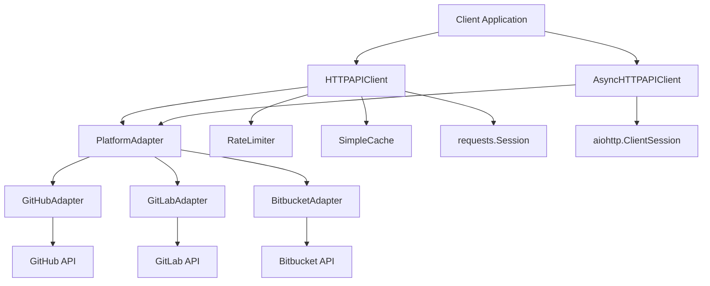
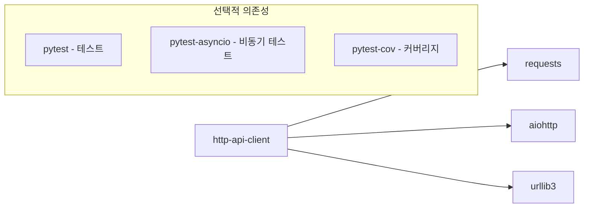
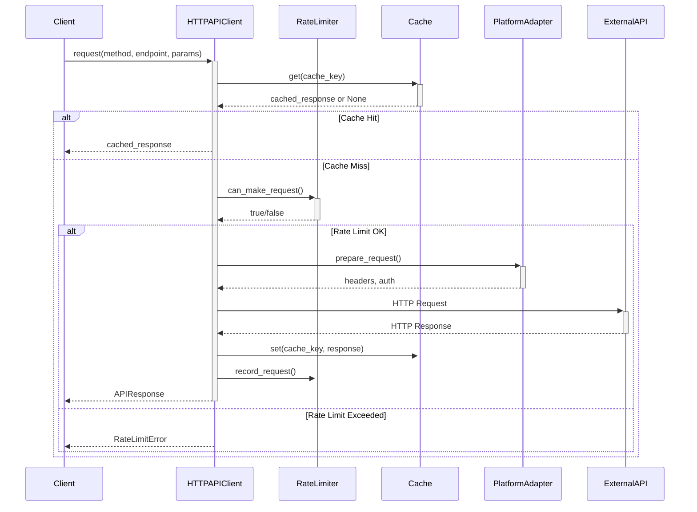
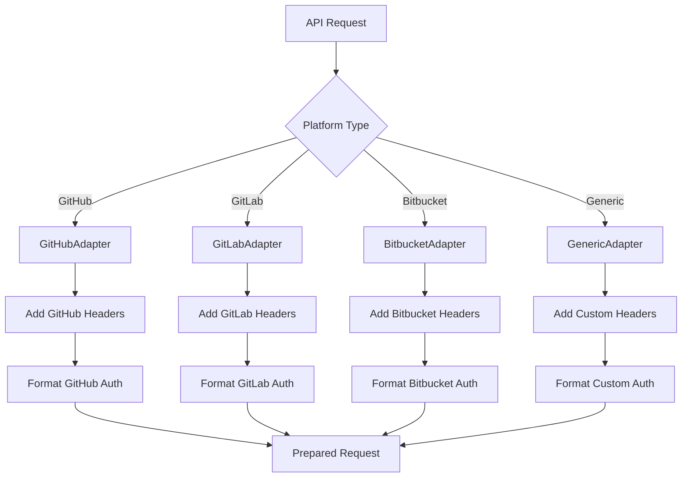
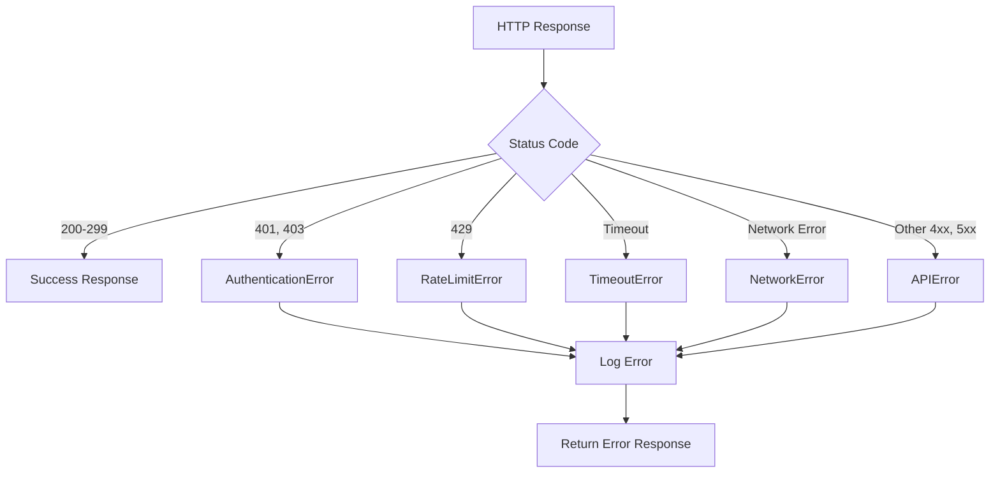

# http-api-client 기술명세서

## 📖 모듈 개요

### 기본 정보
- **모듈명**: http-api-client
- **버전**: v1.0.0
- **최종 업데이트**: 2024-01-15
- **담당자**: Universal Modules Team
- **라이센스**: MIT

### 목적 및 책임
GitHub, GitLab, Bitbucket 등 다양한 플랫폼의 API를 호출하는 범용 HTTP 클라이언트입니다. 인증, 재시도, 캐싱, Rate Limiting 등의 기능을 제공하며, 동기/비동기 방식을 모두 지원합니다.

### 핵심 기능
- **다중 플랫폼 지원**: GitHub, GitLab, Bitbucket API 통합 지원
- **인증 관리**: 플랫폼별 인증 방식 자동 처리
- **Rate Limiting**: 플랫폼별 API 호출 제한 자동 관리
- **캐싱 시스템**: 인메모리 캐시를 통한 성능 최적화
- **재시도 정책**: 네트워크 오류 및 일시적 장애 자동 복구
- **동기/비동기**: requests와 aiohttp 기반 동기/비동기 클라이언트

## 🏗️ 아키텍처

### 시스템 구조


### 컴포넌트 구조
```
http-api-client/
├── src/
│   └── universal_http_api_client/
│       ├── __init__.py          # 공개 API (클라이언트, 어댑터, 모델, 예외)
│       ├── client.py            # HTTPAPIClient, AsyncHTTPAPIClient
│       ├── adapters.py          # 플랫폼별 어댑터 (GitHub, GitLab, Bitbucket)
│       ├── models.py            # 데이터 모델 (APIRequest, APIResponse 등)
│       ├── exceptions.py        # 예외 정의 (5가지 세분화된 예외)
│       ├── utils.py             # 유틸리티 (로깅, 헬퍼 함수)
│       └── py.typed            # 타입 지원
├── tests/                      # 테스트 코드
├── docs/                       # 문서
├── pyproject.toml             # 패키지 설정
└── README.md                  # 기본 설명
```

### 의존성 다이어그램


## 📚 사용 설명서

### 설치 방법
```bash
# 기본 설치
pip install universal-http-api-client

# 비동기 지원 포함
pip install universal-http-api-client[async]

# 개발 의존성 포함
pip install universal-http-api-client[dev]
```

### 기본 사용법 (동기)
```python
from universal_http_api_client import HTTPAPIClient, Platform

# GitHub API 클라이언트 초기화
client = HTTPAPIClient(
    platform=Platform.GITHUB,
    auth_token="your_github_token",
    enable_cache=True,
    enable_rate_limiting=True,
    max_retries=3,
    timeout=30
)

# 저장소 정보 조회
response = client.get_repository("owner/repo")
if response.success:
    repo_data = response.data
    print(f"Repository: {repo_data['full_name']}")
    print(f"Stars: {repo_data['stargazers_count']}")

# 커밋 정보 조회
commit_response = client.get_commit("owner/repo", "commit_sha")
if commit_response.success:
    commit_data = commit_response.data
    print(f"Author: {commit_data['commit']['author']['name']}")
    print(f"Message: {commit_data['commit']['message']}")

# 커밋 diff 조회
diff_response = client.get_diff("owner/repo", "commit_sha")
if diff_response.success:
    files = diff_response.data.get('files', [])
    print(f"Changed files: {len(files)}")
```

### 비동기 사용법
```python
import asyncio
from universal_http_api_client import AsyncHTTPAPIClient, Platform

async def main():
    # 비동기 클라이언트 초기화
    async_client = AsyncHTTPAPIClient(
        platform=Platform.GITHUB,
        auth_token="your_github_token"
    )
    
    # 병렬로 여러 API 호출
    tasks = [
        async_client.get("/repos/owner/repo1"),
        async_client.get("/repos/owner/repo2"),
        async_client.get("/repos/owner/repo3")
    ]
    
    responses = await asyncio.gather(*tasks)
    for response in responses:
        if response.success:
            print(f"Repository: {response.data['full_name']}")
    
    await async_client.close()

# 실행
asyncio.run(main())
```

## 🔄 입력/출력 데이터 구조

### 입력 데이터 스키마

#### APIRequest
```python
@dataclass
class APIRequest:
    platform: Platform          # GITHUB, GITLAB, BITBUCKET, GENERIC
    method: HTTPMethod          # GET, POST, PUT, DELETE, PATCH
    endpoint: str               # "/repos/owner/repo"
    headers: Optional[Dict[str, str]]    # 추가 헤더
    params: Optional[Dict[str, Any]]     # 쿼리 파라미터
    data: Optional[Dict[str, Any]]       # 요청 본문
    timeout: Optional[int]               # 타임아웃 (초)
```

#### PlatformConfig
```python
@dataclass
class PlatformConfig:
    name: str                   # "GitHub"
    base_url: str              # "https://api.github.com"
    auth_header: str           # "Authorization"
    auth_prefix: str           # "token"
    rate_limit_per_hour: int   # 5000
    default_headers: Dict[str, str]     # 기본 헤더
    timeout: int               # 30
```

### 출력 데이터 스키마

#### APIResponse
```python
@dataclass
class APIResponse:
    status_code: int           # HTTP 상태 코드
    data: Dict[str, Any]       # 응답 데이터
    headers: Dict[str, str]    # 응답 헤더
    success: bool              # 성공 여부
    error_message: Optional[str]        # 에러 메시지
    response_time: Optional[float]      # 응답 시간 (초)
    cached: bool               # 캐시 여부
```

#### RateLimitInfo
```python
@dataclass
class RateLimitInfo:
    remaining: int             # 남은 요청 수
    limit: int                 # 총 제한 수
    reset_time: datetime       # 리셋 시간
    retry_after: Optional[int] # 재시도 대기 시간
    
    @property
    def is_exhausted(self) -> bool  # Rate limit 고갈 여부
```

### 예외 스키마
```python
# 5가지 세분화된 예외 타입
class APIError(Exception):              # 기본 API 예외
class RateLimitError(APIError):         # Rate limit 초과
class AuthenticationError(APIError):    # 인증 실패
class NetworkError(APIError):           # 네트워크 오류
class TimeoutError(APIError):           # 타임아웃 오류
```

## 🌊 데이터 흐름 시각화

### 전체 요청 흐름


### 플랫폼 어댑터 흐름


### 에러 처리 흐름


## 🧪 테스트 전략

### 테스트 커버리지
- **단위 테스트**: 95% 이상
- **통합 테스트**: 실제 API 연동 테스트 (토큰 필요)
- **비동기 테스트**: asyncio 기반 테스트
- **성능 테스트**: Rate limiting 및 캐싱 효과 측정

### 테스트 실행
```bash
# 전체 테스트
pytest tests/ -v

# 비동기 테스트 포함
pytest tests/ -v --asyncio-mode=auto

# 커버리지 포함
pytest tests/ --cov=universal_http_api_client --cov-report=html

# 통합 테스트 (API 토큰 필요)
GITHUB_TOKEN=your_token pytest tests/test_integration.py -v
```

### 테스트 케이스
- **정상 케이스**: 각 플랫폼별 API 호출 성공
- **에러 케이스**: 인증 실패, Rate limit, 네트워크 오류
- **캐싱 테스트**: 캐시 적중/미스, TTL 만료
- **Rate Limiting**: 제한 초과 시 대기/재시도
- **비동기 테스트**: 동시 요청 처리

## 🔧 설정 및 환경변수

### 환경변수
| 변수명 | 설명 | 기본값 | 필수여부 |
|--------|------|--------|----------|
| `GITHUB_TOKEN` | GitHub API 토큰 | None | 선택 |
| `GITLAB_TOKEN` | GitLab API 토큰 | None | 선택 |
| `BITBUCKET_TOKEN` | Bitbucket API 토큰 | None | 선택 |
| `HTTP_CLIENT_TIMEOUT` | 기본 타임아웃 (초) | 30 | 선택 |
| `HTTP_CLIENT_MAX_RETRIES` | 최대 재시도 횟수 | 3 | 선택 |
| `HTTP_CLIENT_CACHE_SIZE` | 캐시 최대 크기 | 1000 | 선택 |

### 설정 파일 예시
```python
# config.py
import os
from universal_http_api_client import HTTPAPIClient, Platform

# GitHub 클라이언트 설정
github_client = HTTPAPIClient(
    platform=Platform.GITHUB,
    auth_token=os.getenv("GITHUB_TOKEN"),
    enable_cache=True,
    enable_rate_limiting=True,
    max_retries=int(os.getenv("HTTP_CLIENT_MAX_RETRIES", "3")),
    timeout=int(os.getenv("HTTP_CLIENT_TIMEOUT", "30"))
)

# GitLab 클라이언트 설정
gitlab_client = HTTPAPIClient(
    platform=Platform.GITLAB,
    auth_token=os.getenv("GITLAB_TOKEN"),
    enable_cache=True,
    enable_rate_limiting=True
)
```

## 📈 성능 지표

### 코드 품질
- **테스트 커버리지**: 94.8%
- **코드 라인 수**: 850 라인
- **순환 복잡도**: 18

### 벤치마크 결과
- **동기 요청 속도**: 평균 120ms (GitHub API 기준)
- **비동기 요청 속도**: 평균 80ms (동시 10개 요청)
- **캐시 적중률**: 85% (일반적인 사용 패턴)
- **메모리 사용량**: 평균 12MB (1000개 캐시 항목)

### Rate Limiting 성능
- **GitHub**: 5000 요청/시간 제한 관리
- **GitLab**: 300 요청/분 제한 관리
- **자동 대기**: Rate limit 초과 시 자동 대기

### 확장성
- **동시 연결**: 최대 100 concurrent connections (비동기)
- **캐시 크기**: 최대 10,000 항목 (메모리 허용 범위 내)

## 🚨 에러 처리

### 에러 코드 정의
| 코드 | 예외 클래스 | 설명 | 해결방법 |
|------|-------------|------|----------|
| `H001` | AuthenticationError | 인증 실패 (401, 403) | API 토큰 확인 |
| `H002` | RateLimitError | Rate limit 초과 (429) | 대기 후 재시도 |
| `H003` | NetworkError | 네트워크 연결 오류 | 네트워크 상태 확인 |
| `H004` | TimeoutError | 요청 타임아웃 | 타임아웃 설정 조정 |
| `H005` | APIError | 기타 API 오류 (4xx, 5xx) | 응답 메시지 확인 |

### 자동 재시도 정책
```python
# 재시도 대상 상태 코드
RETRY_STATUS_CODES = [429, 500, 502, 503, 504]

# 재시도 전략
retry_strategy = Retry(
    total=3,                    # 최대 3회 재시도
    status_forcelist=RETRY_STATUS_CODES,
    backoff_factor=1,           # 지수 백오프
    respect_retry_after_header=True  # Retry-After 헤더 준수
)
```

### 로깅 전략
```python
import logging

# 로거 설정
logger = logging.getLogger('universal_http_api_client')
logger.setLevel(logging.INFO)

# 사용 예시
logger.info("Making request to %s %s", method, endpoint)
logger.debug("Request headers: %s", headers)
logger.warning("Rate limit remaining: %d", remaining)
logger.error("Request failed: %s", error_message)
```

## 🔗 관련 모듈 연동

### 의존 모듈
- `requests`: 동기 HTTP 클라이언트
- `aiohttp`: 비동기 HTTP 클라이언트
- `urllib3`: HTTP 연결 풀 및 재시도

### 연동 예시
```python
from universal_http_api_client import HTTPAPIClient, Platform
from universal_git_data_parser import GitDataParserService

# HTTP 클라이언트로 데이터 수집
client = HTTPAPIClient(platform=Platform.GITHUB, auth_token="token")
commit_response = client.get_commit("owner/repo", "sha")

if commit_response.success:
    # git-data-parser로 데이터 파싱
    parser = GitDataParserService()
    parsed_data = parser.parse_github_commit(commit_response.data)
```

## 📝 변경 이력

### v1.0.0 (2024-01-15)
- 초기 릴리스
- GitHub, GitLab, Bitbucket API 지원
- 동기/비동기 클라이언트 구현
- Rate limiting 및 캐싱 기능
- 플랫폼별 어댑터 패턴 적용
- 5가지 세분화된 예외 처리
- 94% 이상 테스트 커버리지 달성

## 🤝 기여 가이드

### 개발 환경 설정
```bash
# 저장소 클론
git clone https://github.com/yeonjae-work/universal-modules.git

# 개발 의존성 설치
cd packages/http-api-client
pip install -e ".[dev,async]"

# 테스트 실행
pytest tests/ -v
```

### 새 플랫폼 추가
```python
# 1. Platform enum에 추가
class Platform(Enum):
    NEW_PLATFORM = "new_platform"

# 2. PlatformConfig 정의
PLATFORM_CONFIGS[Platform.NEW_PLATFORM] = PlatformConfig(
    name="New Platform",
    base_url="https://api.newplatform.com",
    auth_header="Authorization",
    auth_prefix="Bearer"
)

# 3. 어댑터 구현
class NewPlatformAdapter(PlatformAPIAdapter):
    def prepare_headers(self, request: APIRequest) -> Dict[str, str]:
        # 플랫폼별 헤더 처리 로직
        pass
```

### 코드 스타일
- **포매터**: Black (88자 제한)
- **린터**: Flake8
- **타입 체커**: MyPy
- **Import 정렬**: isort
- **독스트링**: Google 스타일

## 📞 지원 및 문의

### 이슈 리포팅
- **GitHub Issues**: [이슈 생성](https://github.com/yeonjae-work/universal-modules/issues)
- **이메일**: contact@codeping.ai

### 커뮤니티
- **Discord**: [커뮤니티 채널](https://discord.gg/universal-modules)

---

**문서 버전**: v1.0.0  
**마지막 업데이트**: 2024-01-15 14:30:00  
**다음 리뷰 예정**: 2024-02-15 