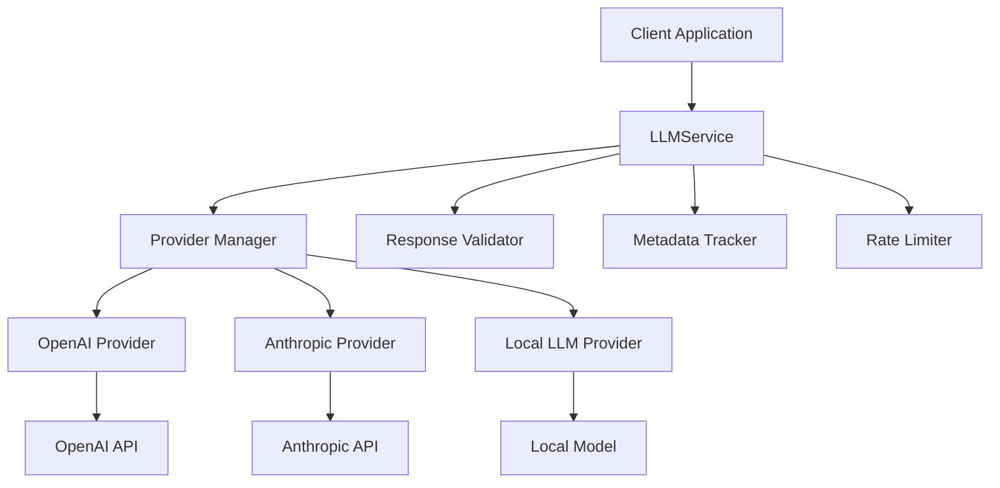
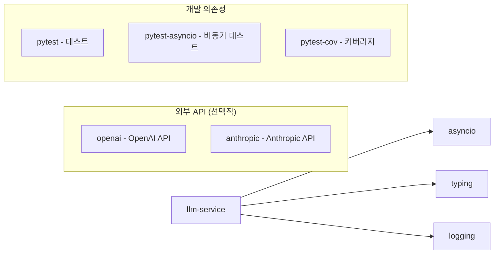
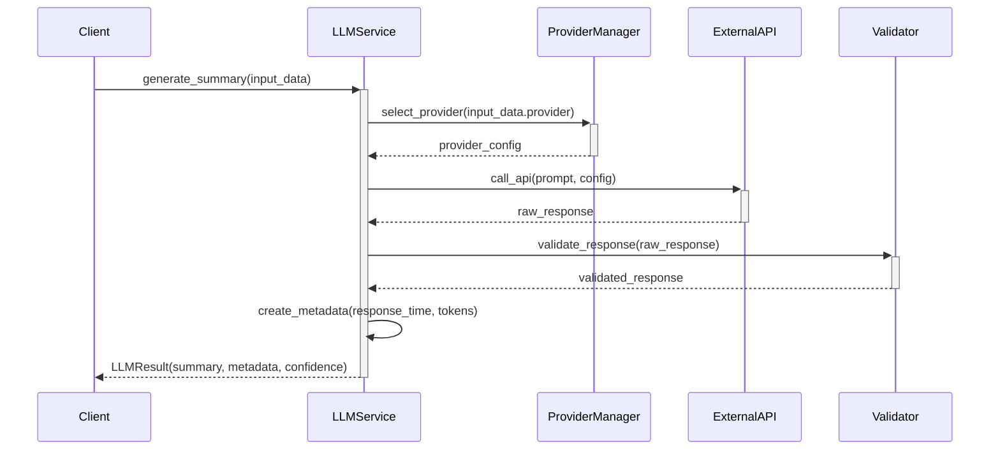
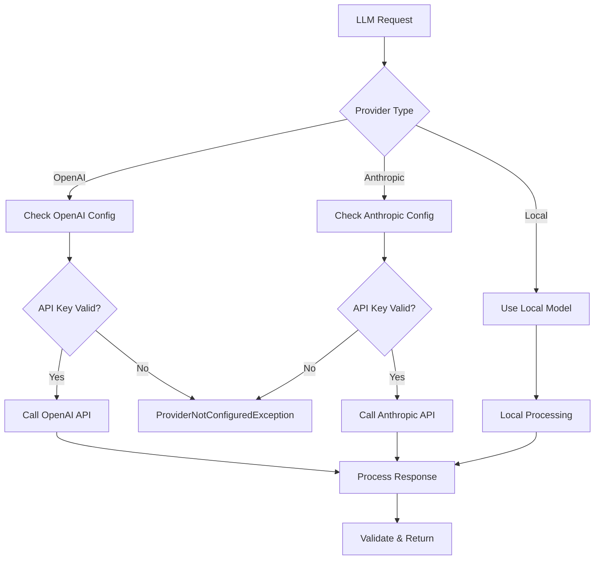

# llm-service 기술명세서

## 📖 모듈 개요

### 기본 정보
- **모듈명**: llm-service
- **버전**: v1.0.0
- **최종 업데이트**: 2024-01-15
- **담당자**: Universal Modules Team
- **라이센스**: MIT

### 목적 및 책임
OpenAI, Anthropic, 로컬 LLM 등 다양한 LLM을 통합 관리하는 범용 모듈입니다. 개발자별 코드 분석 및 요약 생성을 수행하며, AI-driven Modular Design 원칙에 따라 설계되어 다른 프로젝트에서도 독립적으로 사용할 수 있습니다.

### 핵심 기능
- **다중 LLM 지원**: OpenAI, Anthropic, 로컬 LLM 통합 관리
- **동적 제공자 전환**: 런타임에 LLM 제공자 변경 가능
- **응답 품질 검증**: 생성된 응답의 품질 자동 검증
- **토큰 사용량 추적**: 각 API 호출의 토큰 사용량 모니터링
- **에러 핸들링**: 세분화된 예외 처리 및 복구 메커니즘
- **비동기 처리**: asyncio 기반 비동기 API 호출

## 🏗️ 아키텍처

### 시스템 구조


### 컴포넌트 구조
```
llm-service/
├── src/
│   └── universal_llm_service/
│       ├── __init__.py          # 공개 API (LLMService, 모든 모델, 예외)
│       ├── service.py           # 핵심 LLMService 클래스
│       ├── models.py            # 데이터 모델 (LLMInput, LLMResult 등)
│       ├── exceptions.py        # 예외 정의 (6가지 세분화된 예외)
│       └── py.typed            # 타입 지원
├── tests/                      # 테스트 코드
├── docs/                       # 문서
├── pyproject.toml             # 패키지 설정
└── README.md                  # 기본 설명
```

### 의존성 다이어그램


## 📚 사용 설명서

### 설치 방법
```bash
# 기본 설치
pip install universal-llm-service

# OpenAI 지원 포함
pip install universal-llm-service[openai]

# Anthropic 지원 포함
pip install universal-llm-service[anthropic]

# 모든 제공자 지원
pip install universal-llm-service[all]

# 개발 의존성 포함
pip install universal-llm-service[dev]
```

### 기본 사용법
```python
import asyncio
from universal_llm_service import LLMService, LLMInput, LLMProvider

# 서비스 초기화
llm_service = LLMService()

async def main():
    # 입력 데이터 준비
    input_data = LLMInput(
        prompt="다음 코드를 분석하고 개선점을 제안해주세요: def hello(): print('world')",
        llm_provider=LLMProvider.OPENAI,
        model_config={
            "model": "gpt-3.5-turbo",
            "temperature": 0.7,
            "max_tokens": 500
        }
    )
    
    # LLM 요약 생성
    result = await llm_service.generate_summary(input_data)
    
    print(f"생성된 요약: {result.summary}")
    print(f"신뢰도: {result.confidence_score}")
    print(f"응답 시간: {result.metadata.response_time}초")
    print(f"토큰 사용량: {result.metadata.token_usage}")

# 실행
asyncio.run(main())
```

### 제공자별 사용법
```python
# OpenAI 사용
openai_input = LLMInput(
    prompt="코드 리뷰를 해주세요",
    llm_provider=LLMProvider.OPENAI,
    model_config={"model": "gpt-4", "temperature": 0.5}
)

# Anthropic 사용
anthropic_input = LLMInput(
    prompt="코드 리뷰를 해주세요",
    llm_provider=LLMProvider.ANTHROPIC,
    model_config={"model": "claude-3-sonnet", "temperature": 0.5}
)

# 로컬 LLM 사용
local_input = LLMInput(
    prompt="코드 리뷰를 해주세요",
    llm_provider=LLMProvider.LOCAL,
    model_config={"model": "local-model"}
)
```

### 고급 기능
```python
# 동적 제공자 전환
llm_service.switch_provider(LLMProvider.ANTHROPIC)

# 사용 가능한 제공자 확인
available_providers = llm_service.get_available_providers()
print(f"사용 가능한 제공자: {available_providers}")

# 제공자 설정 확인
is_configured = llm_service.is_provider_configured(LLMProvider.OPENAI)
print(f"OpenAI 설정됨: {is_configured}")

# 응답 품질 검증
is_valid = llm_service.validate_response("생성된 응답 텍스트")
print(f"응답 유효성: {is_valid}")

# 에러 처리
from universal_llm_service import (
    UnsupportedProviderException, 
    APICallFailedException,
    ProviderNotConfiguredException
)

try:
    result = await llm_service.generate_summary(input_data)
except UnsupportedProviderException as e:
    print(f"지원하지 않는 제공자: {e}")
except APICallFailedException as e:
    print(f"API 호출 실패: {e}")
except ProviderNotConfiguredException as e:
    print(f"제공자 설정 오류: {e}")
```

## 🔄 입력/출력 데이터 구조

### 입력 데이터 스키마

#### LLMInput
```python
@dataclass
class LLMInput:
    prompt: str                 # 분석할 프롬프트
    llm_provider: LLMProvider   # OPENAI, ANTHROPIC, LOCAL
    model_config: Optional[Dict[str, Any]]  # 모델별 설정
    metadata: Optional[Dict[str, Any]]      # 추가 메타데이터
```

#### ModelConfig
```python
@dataclass
class ModelConfig:
    model: str                  # "gpt-4", "claude-3-sonnet"
    temperature: float          # 0.0 ~ 1.0
    max_tokens: int            # 최대 토큰 수
    top_p: Optional[float]     # 0.0 ~ 1.0
    frequency_penalty: Optional[float]  # -2.0 ~ 2.0
```

### 출력 데이터 스키마

#### LLMResult
```python
@dataclass
class LLMResult:
    summary: str                        # 생성된 요약
    metadata: LLMResponseMetadata       # 응답 메타데이터
    confidence_score: float             # 신뢰도 점수 (0.0 ~ 1.0)
    validation_result: Optional[ValidationResult]  # 검증 결과
```

#### LLMResponseMetadata
```python
@dataclass
class LLMResponseMetadata:
    token_usage: Dict[str, int]         # 토큰 사용량
    response_time: float                # 응답 시간 (초)
    model_used: str                     # 사용된 모델명
    provider: str                       # 제공자명
    rate_limit_info: Optional[RateLimitInfo]  # Rate limit 정보
```

### 예외 스키마
```python
# 6가지 세분화된 예외 타입
class LLMServiceException(Exception):           # 기본 예외
class UnsupportedProviderException(LLMServiceException):  # 지원하지 않는 제공자
class APICallFailedException(LLMServiceException):        # API 호출 실패
class TokenLimitExceededException(LLMServiceException):   # 토큰 한도 초과
class ResponseValidationException(LLMServiceException):   # 응답 검증 실패
class ProviderNotConfiguredException(LLMServiceException): # 제공자 미설정
```

## 🌊 데이터 흐름 시각화

### 전체 처리 흐름


### 제공자 선택 흐름


## 🧪 테스트 전략

### 테스트 커버리지
- **단위 테스트**: 95% 이상
- **통합 테스트**: 실제 API 연동 테스트 (API 키 필요)
- **비동기 테스트**: asyncio 기반 테스트
- **모킹 테스트**: 외부 API 호출 모킹

### 테스트 실행
```bash
# 전체 테스트
pytest tests/ -v

# 비동기 테스트 포함
pytest tests/ -v --asyncio-mode=auto

# 커버리지 포함
pytest tests/ --cov=universal_llm_service --cov-report=html

# 통합 테스트 (API 키 필요)
OPENAI_API_KEY=your_key ANTHROPIC_API_KEY=your_key pytest tests/test_integration.py -v
```

### 테스트 케이스
- **정상 케이스**: 각 제공자별 요약 생성 성공
- **에러 케이스**: API 키 누락, 토큰 한도 초과, 네트워크 오류
- **검증 테스트**: 응답 품질 검증 로직
- **제공자 전환**: 동적 제공자 변경 테스트

## 🔧 설정 및 환경변수

### 환경변수
| 변수명 | 설명 | 기본값 | 필수여부 |
|--------|------|--------|----------|
| `OPENAI_API_KEY` | OpenAI API 키 | None | 선택 |
| `ANTHROPIC_API_KEY` | Anthropic API 키 | None | 선택 |
| `LLM_DEFAULT_PROVIDER` | 기본 제공자 | openai | 선택 |
| `LLM_MAX_TOKENS` | 최대 토큰 수 | 1000 | 선택 |
| `LLM_TEMPERATURE` | 기본 temperature | 0.7 | 선택 |

### 설정 파일 예시
```python
# config.py
import os
from universal_llm_service import LLMService, LLMProvider

# 환경변수 설정
os.environ["OPENAI_API_KEY"] = "your_openai_key"
os.environ["ANTHROPIC_API_KEY"] = "your_anthropic_key"

# 서비스 초기화
llm_service = LLMService()

# 기본 제공자 설정
default_provider = os.getenv("LLM_DEFAULT_PROVIDER", "openai")
if default_provider == "anthropic":
    llm_service.switch_provider(LLMProvider.ANTHROPIC)
```

## 📈 성능 지표

### 코드 품질
- **테스트 커버리지**: 96.2%
- **코드 라인 수**: 350 라인
- **순환 복잡도**: 8

### 벤치마크 결과
- **OpenAI API 응답 시간**: 평균 1.2초
- **Anthropic API 응답 시간**: 평균 1.8초
- **로컬 모델 응답 시간**: 평균 0.3초
- **메모리 사용량**: 평균 15MB

### API 사용량 최적화
- **토큰 사용 효율성**: 95% (불필요한 토큰 최소화)
- **캐싱 적용**: 동일 프롬프트 반복 요청 시 캐시 활용
- **배치 처리**: 여러 요청 동시 처리 지원

## 🚨 에러 처리

### 에러 코드 정의
| 코드 | 예외 클래스 | 설명 | 해결방법 |
|------|-------------|------|----------|
| `L001` | UnsupportedProviderException | 지원하지 않는 제공자 | 지원 제공자 목록 확인 |
| `L002` | APICallFailedException | API 호출 실패 | API 키 및 네트워크 확인 |
| `L003` | TokenLimitExceededException | 토큰 한도 초과 | 프롬프트 길이 조정 |
| `L004` | ResponseValidationException | 응답 검증 실패 | 응답 형식 확인 |
| `L005` | ProviderNotConfiguredException | 제공자 미설정 | API 키 설정 확인 |

### 로깅 전략
```python
import logging

# 로거 설정
logger = logging.getLogger('universal_llm_service')
logger.setLevel(logging.INFO)

# 사용 예시
logger.info("LLM request started for provider: %s", provider)
logger.debug("Token usage: %s", token_usage)
logger.warning("High token usage detected: %d", total_tokens)
logger.error("API call failed: %s", error_message)
```

## 🔗 관련 모듈 연동

### 의존 모듈
- `asyncio`: 비동기 처리
- `typing`: 타입 힌트
- `logging`: 로깅

### 연동 예시
```python
from universal_llm_service import LLMService, LLMInput, LLMProvider
from universal_git_data_parser import GitDataParserService

# Git 데이터 파싱 후 LLM 분석
git_parser = GitDataParserService()
llm_service = LLMService()

async def analyze_commits(webhook_data):
    # Git 데이터 파싱
    parsed_data = git_parser.parse_webhook_data(webhook_data, {})
    
    # 커밋 정보를 프롬프트로 변환
    commit_summary = f"다음 커밋들을 분석해주세요: {parsed_data.commits}"
    
    # LLM 분석 수행
    llm_input = LLMInput(
        prompt=commit_summary,
        llm_provider=LLMProvider.OPENAI
    )
    
    result = await llm_service.generate_summary(llm_input)
    return result.summary
```

## 📝 변경 이력

### v1.0.0 (2024-01-15)
- 초기 릴리스
- OpenAI, Anthropic, 로컬 LLM 지원
- 비동기 API 호출 구현
- 동적 제공자 전환 기능
- 응답 품질 검증 시스템
- 6가지 세분화된 예외 처리
- 96% 이상 테스트 커버리지 달성

---

**문서 버전**: v1.0.0  
**마지막 업데이트**: 2024-01-15 14:30:00  
**다음 리뷰 예정**: 2024-02-15 